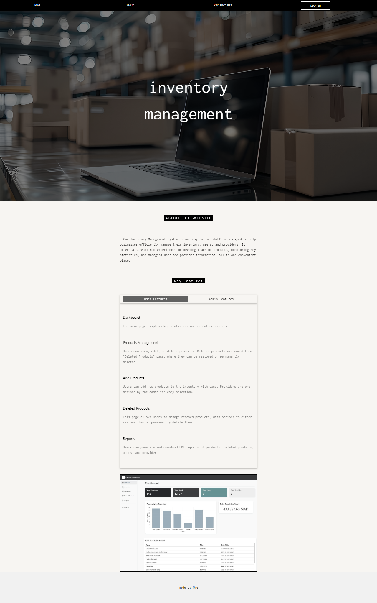
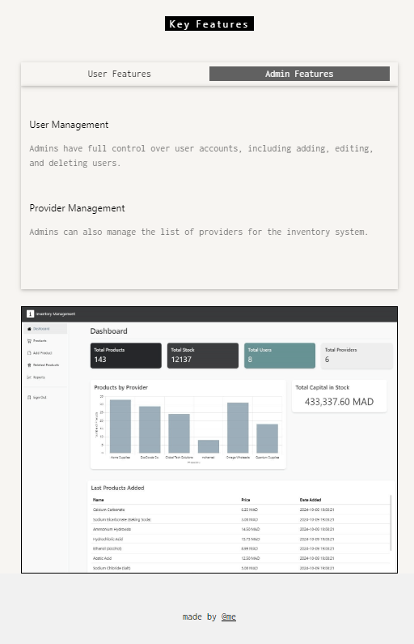
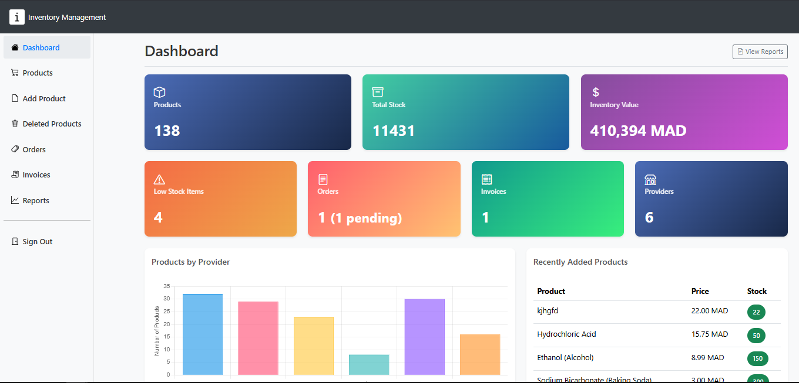
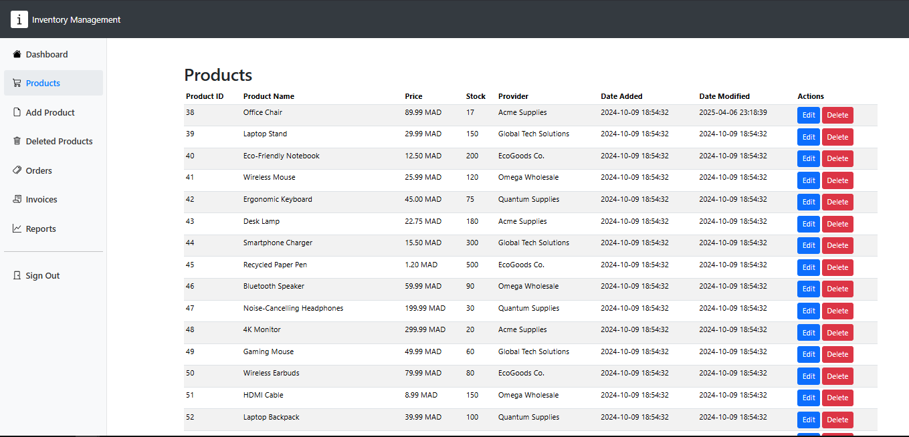

# Inventory Management System

This Inventory Management System allows you to efficiently manage products, users, and providers. It provides comprehensive features for inventory tracking, user management, and report generation using a clean, user-friendly interface.

## Features

- **Normal and Admin Users**: Each user type has different privileges, with admin users having full access to user and providers management , and the normal user can do everything else.
- **Dashboard**: Provides an overview of key metrics, such as total products, total stock, and total users.
- **Product Management**: Add, edit, or delete products from the system.
- **Product Recycle Bin**: Restore products or permanently delete them from the system.
- **Provider Management**: Admins can add and update provider details.
- **User Management**: Admins can manage system users, including adding, editing, or removing users.
- **Reports**: View and export reports for products, users, deleted products, and providers.

## Screenshots

### Main Page 





### Login


### Dashboard


### Product Management


### Add Product


### Edit Product Modal


### Provider Management


### Reports Page


### Export Report


## Credentials

Normal User :

  - **Email**: admin@admin.com
  - **Password**: password

Admin User :

  - **Email**: admin@admin.com
  - **Password**: password

## Installation

1. **Clone or download the repository**:
    ```bash
    git clone https://github.com/migi-gluttony/inventory_management.git
    ```
2. **Move files to the root folder** of your server (e.g., for XAMPP, the location is `C:\xampp\htdocs\InventorySystem`).
3. **Set up the database**:
   - Open PhpMyAdmin from your local application server.
   - Create a new database named `stock`.
   - Import the `stock.sql` file from the `database` folder into the `stock` database.
4. **Start Apache and MySQL** on your application server's control panel.
5. **Access the system**: Go to `http://localhost/InventorySystem/` in your browser.

## Requirements

- **PHP** version 8.0.0 or newer (recommended).
- **Database**: MySQL or compatible.
- **Application Server**: Choose from LAMP, MAMP, or XAMPP.

## Resources

- **Original Source Code**: Placeholder for the original source.
- **Framework**: CodeIgniter - Web Framework.
- **Theme**: AdminLTE - Dashboard and Admin Theme.

---

Feel free to contribute or suggest improvements. Fork the repository and submit a pull request for any major changes.
