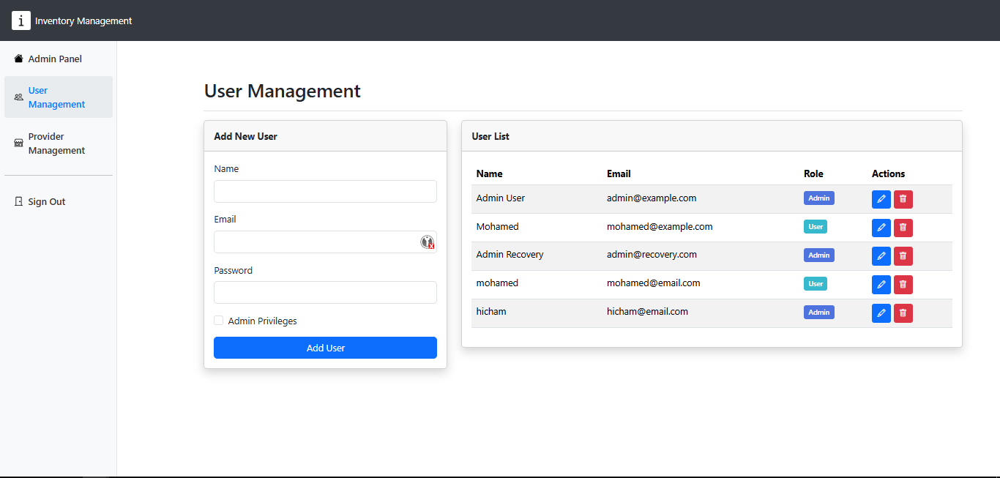

<h1 align="center"><a href="https://github.com/migi-gluttony/inventory_management">Inventory Management System</a></h1>

<h3 align="center">
  
</h3>

<h4 align="center">An Inventory System using Bootstrap, JavaScript, MySQL & PHP</h4>

# Inventory Management System

Efficiently manage products, users, and providers with a clean, user-friendly interface.

## Key Features

- Dashboard: Overview of key metrics
- Product Management: Add, edit, delete products 
- Recycle Bin: Restore or permanently delete products
- Reports: Generate and export PDF reports
- User Management: Admins can add, edit, remove users
- Provider Management: Admins can manage providers

## Screenshots

### Dashboard

### Product Management

### User Management

## Installation

1. Clone the repository
2. Move files to server root folder 
3. Set up the database:
   - Create `inventory_management` database
   - Import `inventory_management.sql` 
4. Start Apache and MySQL
5. Access at `http://localhost/inventory_management/`

## Requirements

- PHP 8.0.0+
- MySQL 
- Apache, Nginx, or compatible web server

## Default Credentials

Normal User:
  - Email: mohamed@example.com
  - Password: password

Admin User:
  - Email: admin@example.com 
  - Password: password